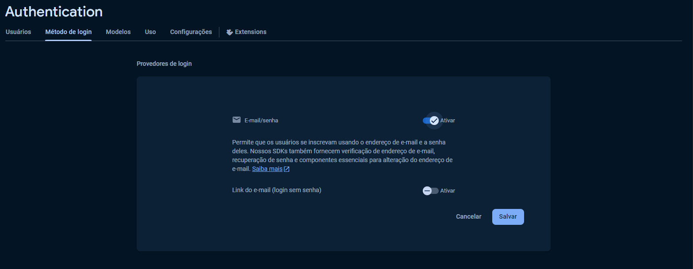

# 2MOBR - Trabalho final das disciplinas de Android

## Proposta

Criar um aplicativo mobile Android que contenha:

### Requisito 1 - Desenvolvimento da API e/ou Firebase

A aplicação deverá ter as seguintes funcionalidades:

- Login
- Criação de usuário
- CRUD (por exemplo produto, carro, casa, coisa)
    - Listar todos
    - Apagar
    - Salvar
    - Atualizar
- Realizar o deploy da API na nuvem (caso tenha integração)

### Requisito 2 - Tela de Login

- Validar os dados do usuário
- Possibilitar a criação de uma nova conta

### Requisito 3 – Tela de Cadastro
- O aplicativo deverá conter pelo menos uma tela para realizar cadastro.
- As informações a serem cadastradas ficam livre para o aluno escolher.

  Por exemplo: cadastro de imóveis visitados, loja com determinados produtos desejados.
- Os dados deverão ser persistidos na nuvem.

### Requisito 4 – Tela Lista de Exibição dos Dados

- Utilizar o RecyclerView para exibir os dados gravados na tela anterior.
- O usuário poderá realizar a exclusão do registro através da lista.

### Requisito 5 – Tela de Edição dos dados

- Através do RecyclerView o usuário poderá abrir a tela de edição e realizar a alteração dos dados.

### Considerações
- Para uma maior abrangência de usuários o aplicativo deverá ter o idioma padrão como inglês e ter suporte (tradução para o português)
- Para facilitar a manutenção do aplicativo deverá ser seguidos os padrões da plataforma Android em relação aos recursos (res, strings, colors, arrays, dimens, styles, entre outros).
- O aplicativo deverá atender a partir da API 21 do Android. Deverá funcionar tanto em
smartphones quanto em tablets, e proporcionar uma ótima experiência para o usuário.

## Principais tecnologias

- Kotlin
- Firebase (Firebase Auth e Firestore)
- ViewModel
- Navigation (safe args)

## Como rodar o projeto

- Fazer o clone do repositório.
- Criar um projeto do Firebase (passo-a-passo [aqui](https://firebase.google.com/docs/android/setup)) e adicionar o arquivo `google-services.json` dentro da pasta `app`.
- Na parte de Authentication, ativar o método de login e-mail/senha.

- No Firestore, criar um banco de dados, iniciar no modo de produção.

- Ainda no Firestore, em Regras, alterar de `allow read, write: if false;` para `allow read, write: if true;`, caso dê erro de acesso negado.

- No Android Studio, fazer o build e rodar o aplicativo.